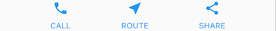

# Flutter basic

# Pendahuluan

Pada modul ini, pembahasan keseluruhan berfokus pada dasar-dasar pada flutter mulai dari pengenalan basic widget, penggunaan material component, dan lain-lain.

---

# Flutter First App

Ketika kalian init project nya, maka kalian akan menjumpai konfigurasi default dari flutternya, yaitu aplikasi counter number

[https://github.com/ristafn/flutter-session/tree/main/flutter-basic/flutter_basic](https://github.com/ristafn/flutter-session/tree/main/flutter-basic/flutter_basic)

---

# Stateful dan Stateless widgets

Sebuah widget bisa saja Stateful atau Stateless tergantung pada interaksi user dengan wigetnya.

Kondisi :

- Gunakan StatefulWidget ketika ada perubahan pada widget. Contoh `Checkbox`, `Radio`, `Slider`, `InkWell`, `Form` dan `TextField` adalah widget-widget yang bersifat dynamic, bisa berubah tergantung pada interaksi user.
- Gunakan StatelessWidget ketika tidak ada perubahan pada widget. Contoh `Icon`, `IconButton`, dan `Text` adalah widget-widget yang tidak berubah ketika mengalami interaksi dengan user

---

# Widget

Widget adalah class yang digunakan untuk keperluan UI dan layout. Mekanisme inti dari flutter terletak pada widget. Contoh dari penggunaan widget :




Jika kita bedah widget tree-nya, maka akan terdapat beberapa widget dengan struktur seperti berikut :


> `Container` berwarna pink digunakan untuk indikator bahwa container bisa merubah penempatan widget dibawahnya, seperti menambahkan padding, margins, borders, atau background color,

## Common layout widgets

Berikut adalah widget-widget yang biasanya digunakan :

## Standard widgets

### Container

`Container` biasanya digunakan untuk,

- Menambahkan margin, padding, dan border
- Mengubah background dengan warna atau gambar
- Bisa berisi kan root widget, dan widget(`Row`, `Column`)

Untuk urutannya seperti ini :


### GridView

`GridView` digunakan untuk membuat list 2 dimensi. Kalian bisa meng-kustomisasi GridViewnya disesuaikan dengan aplikasi yang kalian buat. Ketika `GridView` mendeteksi bahwa isinya terlalu panjang untuk muat di kotak render, maka secara otomatis `GridView` akan bergulir. Berikut yang dihadirkan oleh GridView :

- List widget berbentuk grid
- Otomatis menyediakan scroll
- GridView menyediakan cara penulisan seperti berikut :

  - `GridView.count`
    Gunakan GridView.count untuk membuat grid dengan 2 tiles(ubin) dalam mode potrait dan 3 tiles(ubin) dalam mode landscape.
    Contoh :
    

- `GridView.extent`
  Gunakan GridView.extent untuk membuat grid dengan tiles(ubin) dengan lebar maksimum 150 piksel.
  Contoh :
  

### ListView

`ListView` berperilaku seperti kolom, dan juga ListView akan otomatis menyediakan gulir(scroll) jika panjangnya tidak muat dalam kotak render. Berikut yang dihadirkan oleh `ListView` :

- `ListView` merupakan kolom khusus yang menyediakan list dari box
- Tersedia 2 orientasi penyediaan list, yaitu horizontal dan vertikal
- Otomatis menyediakan scroll
- Sedikit konfigurasi dibanding menggunakan `Column`

Contoh :

Gunakan `ListView` untuk menampilkan `ListTile`

`Divider`(garis horizontal digunakan untuk pemisah)


### Stack

`Stack` digunakan untuk widget bertumpuk, biasanya digunakan juga untuk widget yang bertumpuk dengan gambar. Berikut yand dihadirkan oleh `Stack` :

- `Stack` digunakan untuk widget yang tumpang tindih dengan widget lainnya
- Widget teratas adalah widget dengan urutan terakhir masuk
- `Stack` tidak bisa scroll
- Konten dalam `Stack` dapat di potong jika melebihi kotak render

Contoh :

- Gunakan `Stack` untuk menampilkan widget `Text` diatas `Container` dan diatas widget `CircleAvatar`


- Gunakan `Stack` untuk menampilkan icon diatas gambar


## Material Widgets

### Card

Berikut yang dihadirkan oleh `Card` :

- Menerapkan Material card
- Digunakan untuk menyajikan informasi dalam bentuk card
- `Card` menerima satu parameter child yang bisa berisi `Row`, `Column`, atau widget lainnya yang menyimpan list dari child
- Ditampilkan rounded dan mempunyai drop shadow
- `Card` tidak dapat discroll
- `Card` berasal dari Material library

Contoh :

- `Card` dengan 3 `ListTile` dan satu `Divider` sebagai pemisah. `Card` disini dubah ukurannya dengan menggunakan `SizedBox`


- `Card` yang terdiri dari gambar dan text


### ListTile

Berikut yang dihadirkan oleh `ListTile` :

- Baris khusus yang berisi hingga 3 baris teks dan ikon opsional
- Konfigurasi lebih sedikit dibanding menggunakan `Row`
- `ListTile` berasal dari Material library

Contoh :

- `Card` yang mengandung 3 `ListTile`


- `ListTile` yang menggunakan leading widget


---

# Building Layouts

Dalam tahapan membangun tampilan antarmuka, kita akan mencoba membuat halaman seperti ini


## Step 1, membuat base code

Ganti kode yang ada di lib/main.dart menjadi seperti ini :

```dart
import 'package:flutter/material.dart';

void main() {
  runApp(const MyApp());
}

class MyApp extends StatelessWidget {
  const MyApp({Key? key}) : super(key: key);

  @override
  Widget build(BuildContext context) {
    return MaterialApp(
      title: 'Welcome to Flutter',
      home: Scaffold(
        appBar: AppBar(
          title: const Text('Welcome to Flutter'),
        ),
        body: const Center(
          child: Text('Hello World'),
        ),
      ),
    );
  }
}
```

## Step 2, membuat diagram layout

Kelompokan elemen dasar nya

- Tentukan `Row` dan `Column` nya
- Apakah layout mengandung Grid?
- Apakah layout mengandung tumpukan?
- Apakah UI membutuhkan Tab?
- Perhatikan area yang membutuhkan alignment, padding, atau border


Selanjutnya detailkan setiap elemen dasar yang sudah kita kelompokan tadi


## Step 3, implementasi baris title

Buat `titleSection` seperti kode dibawah ini dan tempatkan didalam method `build()`

```dart
Widget titleSection = Container(
  padding: const EdgeInsets.all(32),
  child: Row(
    children: [
      Expanded(
        /*1*/
        child: Column(
          crossAxisAlignment: CrossAxisAlignment.start,
          children: [
            /*2*/
            Container(
              padding: const EdgeInsets.only(bottom: 8),
              child: const Text(
                'Oeschinen Lake Campground',
                style: TextStyle(
                  fontWeight: FontWeight.bold,
                ),
              ),
            ),
            Text(
              'Kandersteg, Switzerland',
              style: TextStyle(
                color: Colors.grey[500],
              ),
            ),
          ],
        ),
      ),
      /*3*/
      Icon(
        Icons.star,
        color: Colors.red[500],
      ),
      const Text('41'),
    ],
  ),
);
```

## Step 4, implementasi baris button

Buat satu method dengan nilai kembalian Column. Button memerlukan satu buah method yang dimana akan dipanggil dalam sebuah Row sebanyak 3x, karena setiap button memiliki color, icon, label yang kemungkinan yang berbeda itulah mengapa dibuat method ini. Pembuatan method ini juga bertujuan untuk menghindari pembuatan `buttonSection` berulang-ulang.

```dart
class MyApp extends StatelessWidget {
  const MyApp({super.key});

  @override
  Widget build(BuildContext context) {
    // ···
  }

  Column _buildButtonColumn(Color color, IconData icon, String label) {
    return Column(
      mainAxisSize: MainAxisSize.min,
      mainAxisAlignment: MainAxisAlignment.center,
      children: [
        Icon(icon, color: color),
        Container(
          margin: const EdgeInsets.only(top: 8),
          child: Text(
            label,
            style: TextStyle(
              fontSize: 12,
              fontWeight: FontWeight.w400,
              color: color,
            ),
          ),
        ),
      ],
    );
  }
}
```

Buat buttonSection yang dimana widget ini akan memanggil method \_buildButtonColumn dengan masing-masing karakteristiknya.

```dart
Color color = Theme.of(context).primaryColor;

Widget buttonSection = Row(
  mainAxisAlignment: MainAxisAlignment.spaceEvenly,
  children: [
    _buildButtonColumn(color, Icons.call, 'CALL'),
    _buildButtonColumn(color, Icons.near_me, 'ROUTE'),
    _buildButtonColumn(color, Icons.share, 'SHARE'),
  ],
);
```

## Step 5, implementasi bagian text

Buat `textSection` seperti kode dibawah ini dan tempatkan didalam method `build()`

```dart
Widget textSection = const Padding(
  padding: EdgeInsets.all(32),
  child: Text(
    'Lake Oeschinen lies at the foot of the Blüemlisalp in the Bernese '
    'Alps. Situated 1,578 meters above sea level, it is one of the '
    'larger Alpine Lakes. A gondola ride from Kandersteg, followed by a '
    'half-hour walk through pastures and pine forest, leads you to the '
    'lake, which warms to 20 degrees Celsius in the summer. Activities '
    'enjoyed here include rowing, and riding the summer toboggan run.',
    softWrap: true,
  ),
);
```

## Step 6, implementasi bagian gambar

Tambahkan gambar :

- Download gambar berikut :
  [https://raw.githubusercontent.com/flutter/website/master/examples/layout/lakes/step5/images/lake.jpg](https://raw.githubusercontent.com/flutter/website/master/examples/layout/lakes/step5/images/lake.jpg)
- Buat folder images di root projek dan pindahkan gambar yang sudah didownload tadi ke folder images

Untuk memanggil gambar kalian harus mendaftarkan folder asset terlebih dahulu di pubspec.yaml, sesuaikan dengan kode berikut :

```yaml
flutter:
  uses-material-design: true

  assets:
    - images/lake.jpg
```

## Step 7, panggil setiap bagian

Panggil widget yang telat kita buat dan asset gambar yang sudah kita daftar kan (pubspec.yaml) di body

```dart
			body: Column(
          children: [
            Image.asset(
              'images/lake.jpg',
              width: 600,
              height: 240,
              fit: BoxFit.cover,
            ),
            titleSection,
            buttonSection,
            textSection,
          ],
        ),
```

## Step 8, ganti Column dengan ListView

ListView memiliki fitur scroll jika aplikasi di render dalam ukuran layar yang kecil.

```dart
				body: ListView(
          children: [
            Image.asset(
              'images/lake.jpg',
              width: 600,
              height: 240,
              fit: BoxFit.cover,
            ),
            titleSection,
            buttonSection,
            textSection,
          ],
        ),
```

Source code : [https://github.com/ristafn/flutter-session/tree/main/flutter-basic/flutter_build_layout](https://github.com/ristafn/flutter-session/tree/main/flutter-basic/flutter_build_layout)

---

# Daftar pustaka

introduction-widget-flutter, [https://docs.flutter.dev/development/ui/widgets-intro](https://docs.flutter.dev/development/ui/widgets-intro)

widget-catalog, [https://docs.flutter.dev/development/ui/widgets/layout](https://docs.flutter.dev/development/ui/widgets/layout)

Write your first Flutter app, part 1, [https://docs.flutter.dev/get-started/codelab#step-1-create-the-starter-flutter-app](https://docs.flutter.dev/get-started/codelab#step-1-create-the-starter-flutter-app)

# Credit

- GDSC STT NF
- Writer - Rista Fauji Nafsir
